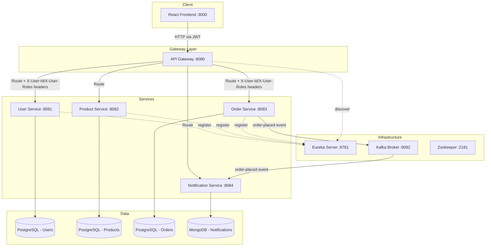

# Design Document: NextGadget Project Modernization

## Overview

This design covers the full modernization of the NextGadget e-commerce platform: upgrading backend dependencies (JJWT 0.12.x, non-deprecated Spring Security APIs), consolidating the Gateway's dual JWT filter into a single mechanism, adding input validation and global error handling across all services, completing the Order Service with user history and Kafka event publishing, fixing circular JSON serialization, building a React 19 + Vite + TypeScript frontend, adding a Node.js Notification Service that consumes Kafka events and stores notifications in MongoDB, creating database schema and seed scripts (with user-specified SQL definitions and imgur-hosted product images), providing a Postman API collection, adding Kafka configuration scripts, adding Docker Compose orchestration (including MongoDB and the notification service), and fixing file naming issues.

The platform currently runs Spring Boot 3.5.0 with Spring Cloud 2025.0.0. The backend has five services (Eureka, Gateway, User, Product, Order) each with their own PostgreSQL database (except Eureka). The Gateway is reactive (WebFlux). There is no frontend or notification service yet.

## Architecture

The existing microservices architecture is preserved. All changes are internal to each service or additive (frontend, notification service, Docker, Kafka, database scripts, Postman collection).



### Key Architectural Decisions

1. **Single JWT filter in Gateway**: Remove `JwtAuthenticationFilter` (GlobalFilter) and keep only the `SecurityConfig` `AuthenticationWebFilter`. The SecurityConfig filter already handles role-based authorization. The GlobalFilter duplicates JWT parsing and has inconsistent public-endpoint logic (it allows all GETs, which is too broad). The consolidated filter will also mutate requests to add `X-User-Id` and `X-User-Roles` headers for downstream services.

2. **JJWT 0.12.x migration**: The 0.12.x API replaces `parserBuilder()` with `Jwts.parser().verifyWith(key).build()`, replaces `setSubject`/`setIssuedAt`/`setExpiration`/`signWith(key, algo)` with the new builder API using `subject()`, `issuedAt()`, `expiration()`, `signWith(key)` (algorithm auto-detected from key type). `Claims` access changes from `getBody()` to `getPayload()`.

3. **Validation via Jakarta Bean Validation**: Add `spring-boot-starter-validation` to User, Product, and Order services. Use `@Valid` on controller `@RequestBody` parameters with constraint annotations on DTOs.

4. **Global error handling via `@RestControllerAdvice`**: Each service gets a shared error response DTO (`ErrorResponse` with `status`, `message`, `timestamp`) and a `GlobalExceptionHandler` that catches `MethodArgumentNotValidException`, `ResourceNotFoundException`, and generic `Exception`.

5. **Frontend as a separate Vite project**: Created in a `frontend/` directory at the repo root. Uses React 19, TypeScript, React Router, Bootstrap 5, and custom CSS inspired by the TopShelf Solutions design (dark navbar, green accent #77f2a1, Roboto font, hover effects, responsive flex layout).

6. **Kafka for order events**: The Order Service already has `spring-kafka` in its pom.xml. We add a `KafkaTemplate<String, String>` bean and publish a JSON event to `order-events` topic after successful order persistence. Failure to publish is logged but does not roll back the order.

7. **Notification Service as Node.js + MongoDB**: A new lightweight microservice in `notification/` that uses Express.js for REST endpoints, KafkaJS for consuming `order-placed` events from the `order-events` topic, and Mongoose for MongoDB persistence. This service does not register with Eureka; the Gateway routes to it via a static URI. It runs on port 8084.

8. **Database scripts for reproducible setup**: SQL schema files in `database/postgres/` use the user-specified table definitions (with `SERIAL` primary keys, `VARCHAR`, `DECIMAL`, `TEXT` types). MongoDB schema validators and seed scripts in `database/mongo/` ensure the notification collection has a consistent structure. Seed data in `database/seed/` provides sample users, products (with imgur-hosted image URLs), and notifications for development.

9. **Postman collection for API exploration**: A single `postman/nextgadget_collection.json` file with organized folders per service, using `{{baseUrl}}` and `{{authToken}}` variables for easy environment switching.

10. **Kafka configuration scripts**: A `kafka-config/` directory at the project root containing topic creation scripts for the `order-events` topic.

## Components and Interfaces

### Backend Service Changes

#### User Service

| Component | Change |
|---|---|
| `pom.xml` | Upgrade JJWT from 0.11.5 → 0.12.6. Add `spring-boot-starter-validation`. |
| `JwtUtil` | Migrate to JJWT 0.12.x API: `Jwts.parser().verifyWith(key).build()`, `Jwts.builder().subject().issuedAt().expiration().signWith(key).compact()`. Remove deprecated `SignatureAlgorithm` enum usage. Include `userId` (Long) as a claim in the token so the Gateway can forward it. |
| `SecurityConfig` | Replace deprecated `.csrf().disable()` chain with lambda DSL: `http.csrf(c -> c.disable())`. Already uses lambda for `sessionManagement` and `authorizeHttpRequests`. |
| `CustomUserDetails` | Return `SimpleGrantedAuthority(user.getRole())` instead of `Collections.emptyList()`. |
| `UserController` | Add `@Valid` on `@RequestBody` parameters. Create a `RegisterRequest` DTO with `@NotBlank` on `username`, `email`, `password` and `@Email` on `email`. |
| `GlobalExceptionHandler` | New `@RestControllerAdvice` class. |
| `ErrorResponse` | New DTO with `status`, `message`, `timestamp`. |

#### Gateway

| Component | Change |
|---|---|
| `pom.xml` | Upgrade JJWT from 0.11.5 → 0.12.6. |
| `SecurityConfig` | Migrate to JJWT 0.12.x API for token parsing. Replace deprecated `.csrf().disable().authorizeExchange()...and()` chain with lambda DSL. Add request mutation to inject `X-User-Id` and `X-User-Roles` headers after successful authentication. Add `GET /api/notifications/**` to public endpoints. |
| `JwtAuthenticationFilter` | **Delete this class.** Its functionality is consolidated into `SecurityConfig`. |
| `JwtService` | **Delete this class.** No longer needed since `SecurityConfig` handles JWT inline. |
| `application.yml` | Add a route for the notification service: `id: notification-service`, `uri: http://notification:8084`, `predicates: Path=/api/notifications/**`. This uses a static URI since the notification service does not register with Eureka. |

#### Product Service

| Component | Change |
|---|---|
| `pom.xml` | Add `spring-boot-starter-validation`. |
| `application.yml` | Remove `database-platform: org.hibernate.dialect.PostgreSQLDialect` (auto-detected by Hibernate with PostgreSQL driver). |
| `ProductController` | Add `@Valid` on `@RequestBody` for `create` and `update` endpoints. |
| `Product` entity | Add `@NotBlank` on `name`, `@Positive` on `price`. |
| `ProductService` | Replace `RuntimeException` throws with `ResourceNotFoundException`. |
| `GlobalExceptionHandler` | New `@RestControllerAdvice` class. |
| `ErrorResponse` | New DTO (same structure as User Service). |

#### Order Service

| Component | Change |
|---|---|
| `application.properties` | **Delete** (duplicate of `application.yml`). |
| `application.yml` | Add Kafka bootstrap-servers config. |
| `pom.xml` | Add `spring-boot-starter-validation`. |
| `Order` entity | Add `@JsonManagedReference` on `items` field. |
| `OrderItem` entity | Add `@JsonBackReference` on `order` field. |
| `OrderController` | Add `GET /api/orders/user/{userId}` endpoint. Add `@Valid` on `@RequestBody` for `placeOrder`. Change `@RequestHeader("user-id")` to `@RequestHeader("X-User-Id")` to match Gateway header. |
| `OrderRequest` DTO | Add `@NotEmpty` on items list. |
| `OrderItemDTO` | Add `@NotNull` on `productId`, `@Positive` on `quantity`. |
| `OrderRepository` | Add `findByUserIdOrderByCreatedAtDesc(Long userId)` method. |
| `OrderService` | Add `getOrdersByUserId(Long userId)` method. Add Kafka event publishing after `placeOrder`. Wrap Kafka publish in try-catch to log failures without affecting order persistence. Replace `RuntimeException` with `ResourceNotFoundException`. |
| `OrderPlacedEvent` | New DTO with `orderId`, `userId`, `totalAmount`, `timestamp`. |
| `GlobalExceptionHandler` | New `@RestControllerAdvice` class. |
| `ErrorResponse` | New DTO (same structure). |

### Frontend Application

```
frontend/
├── index.html
├── package.json
├── tsconfig.json
├── vite.config.ts
├── public/
└── src/
    ├── main.tsx
    ├── App.tsx
    ├── api/
    │   └── client.ts          # Axios instance with JWT interceptor
    ├── context/
    │   ├── AuthContext.tsx     # JWT auth state, login/logout/register
    │   └── CartContext.tsx     # Shopping cart state (localStorage-backed)
    ├── pages/
    │   ├── HomePage.tsx
    │   ├── ProductListPage.tsx
    │   ├── ProductDetailPage.tsx
    │   ├── CartPage.tsx
    │   ├── CheckoutPage.tsx
    │   ├── OrderHistoryPage.tsx
    │   ├── LoginPage.tsx
    │   └── RegisterPage.tsx
    ├── components/
    │   ├── Navbar.tsx
    │   ├── ProductCard.tsx
    │   ├── CartItem.tsx
    │   ├── OrderSummary.tsx
    │   ├── LoadingSpinner.tsx
    │   └── ProtectedRoute.tsx
    ├── types/
    │   └── index.ts           # Product, Order, OrderItem, User, CartItem types
    └── styles/
        └── index.css          # Global styles: Bootstrap 5 overrides + custom TopShelf-inspired CSS
```

### Frontend Styling Approach

The frontend styling is modeled after the TopShelf Solutions reference design but modernized with Bootstrap 5 (upgraded from Bootstrap 4) and custom CSS overrides.

#### Key Styling Elements

- **Bootstrap 5**: Installed via npm (`bootstrap` + `@popperjs/core`). Imported in `main.tsx`. Provides the grid system, navbar component, card component, form controls, and utility classes.
- **Dark Navbar**: Uses Bootstrap's `navbar-dark bg-dark` classes with the NextGadget brand name/logo. Sticky top positioning.
- **Green Accent Color (#77f2a1)**: Applied to the hero/feature section background, primary action buttons, and hover highlights. Custom CSS overrides Bootstrap's default primary color.
- **Roboto Font**: Imported from Google Fonts in `index.html`. Applied globally via `font-family: 'Roboto', sans-serif` on `body`.
- **Product Card Hover Effects**: Product images scale up on hover using `transform: scale(1.05)` with a smooth CSS transition. Cards use Bootstrap's `card` component with custom shadow on hover.
- **Responsive Flex Layout**: Product grids use Bootstrap's `row` + `col-*` responsive grid. On mobile (< 576px), cards stack vertically. On tablet (≥ 576px), 2 columns. On desktop (≥ 992px), 3-4 columns.
- **Form Styling**: Login/register forms use Bootstrap's `form-control` with custom `border-radius: 25px` for rounded inputs, consistent padding, and the green accent on focus borders.
- **Footer**: Clean, dark-themed footer using Bootstrap's `bg-dark text-light` with centered content.

#### CSS Custom Properties (in `styles/index.css`)

```css
:root {
  --ng-accent: #77f2a1;
  --ng-accent-dark: #5cd98a;
  --ng-dark: #343a40;
  --ng-font: 'Roboto', sans-serif;
}
```

#### Key Frontend Interfaces

**API Client** (`api/client.ts`):
- Axios instance with `baseURL: http://localhost:8080` (Gateway)
- Request interceptor that attaches `Authorization: Bearer <token>` from localStorage
- Response interceptor that redirects to login on 401

**AuthContext**:
- `login(username, password)` → POST `/api/users/login` → store token in localStorage
- `register(username, email, password)` → POST `/api/users/register`
- `logout()` → clear token from localStorage
- `isAuthenticated` / `user` state derived from token

**CartContext**:
- `items: CartItem[]` backed by localStorage
- `addToCart(product, quantity)`, `removeFromCart(productId)`, `updateQuantity(productId, qty)`, `clearCart()`
- `totalPrice` computed value

**React Router Routes**:
| Path | Page | Auth Required |
|---|---|---|
| `/` | HomePage | No |
| `/products` | ProductListPage | No |
| `/products/:id` | ProductDetailPage | No |
| `/cart` | CartPage | No |
| `/login` | LoginPage | No |
| `/register` | RegisterPage | No |
| `/checkout` | CheckoutPage | Yes |
| `/orders` | OrderHistoryPage | Yes |

### Docker Compose

```
docker-compose.yml          # Root level
eureka/Dockerfile
gateway/Dockerfile
user/Dockerfile
product/Dockerfile
order/Dockerfile
notification/Dockerfile
frontend/Dockerfile
```

Each backend Java Dockerfile uses a multi-stage build: Maven build stage → JRE runtime stage. The frontend Dockerfile uses a Node build stage → Nginx runtime stage. The notification Dockerfile uses a Node.js base image with a simple `npm install` + `node src/index.js` entrypoint.

Docker Compose services include:
- **postgres**: PostgreSQL 15 with volume mount, exposed on 5432
- **mongodb**: MongoDB 7 with volume mount, exposed on 27017
- **zookeeper**: Zookeeper for Kafka, exposed on 2181
- **kafka**: Kafka broker, exposed on 9092, depends on zookeeper
- **eureka**: Eureka Server on 8761
- **gateway**: API Gateway on 8080, depends on eureka
- **user-service**: User Service on 8081, depends on postgres, eureka
- **product-service**: Product Service on 8082, depends on postgres, eureka
- **order-service**: Order Service on 8083, depends on postgres, eureka, kafka
- **notification**: Notification Service on 8084, depends on mongodb, kafka
- **frontend**: React app served via Nginx on 3000

### Notification Service

```
notification/
├── package.json
├── README.md
├── Dockerfile
└── src/
    ├── index.js                   # Express app setup, Kafka consumer start, server listen
    ├── consumers/
    │   └── orderConsumer.js       # KafkaJS consumer for order-events topic
    ├── controllers/
    │   └── notificationController.js  # Request handlers for notification endpoints
    ├── models/
    │   └── Notification.js        # Mongoose schema/model
    └── routes/
        └── notificationRoutes.js  # Express router definitions
```

#### Mongoose Notification Schema (`models/Notification.js`)

```javascript
{
  userId:    { type: String, required: true, index: true },
  message:   { type: String, required: true },
  status:    { type: String, enum: ['unread', 'read'], default: 'unread' },
  type:      { type: String, default: 'ORDER_EVENT' },
  createdAt: { type: Date, default: Date.now }
}
```

This matches the user-specified MongoDB notification schema:
```javascript
{
  "_id": "ObjectId",
  "userId": "String",
  "message": "Your order #12345 has been placed.",
  "status": "unread",  // or "read"
  "type": "ORDER_EVENT",
  "createdAt": "2025-06-13T14:00:00Z"
}
```

#### Kafka Consumer Design (`consumers/orderConsumer.js`)

- Uses KafkaJS `Kafka` client with `clientId: 'notification-service'` and `groupId: 'notification-group'`
- Subscribes to topic `order-events` with `fromBeginning: false`
- On each message: parses JSON payload (`orderId`, `userId`, `totalAmount`, `timestamp`), creates a Notification document with `status: 'unread'`, `type: 'ORDER_EVENT'`, and a human-readable message like `"Your order #${orderId} has been placed."`
- Errors during message processing are logged but do not crash the consumer (each message handled in try-catch)

#### REST API Endpoints

| Method | Path | Description |
|---|---|---|
| GET | `/api/notifications/:userId` | Get all notifications for a user, sorted by createdAt desc |
| GET | `/api/notifications/:userId/unread` | Get unread notifications for a user |
| PATCH | `/api/notifications/:id/read` | Mark a single notification as read |

#### Dependencies

- `express` — HTTP server and routing
- `mongoose` — MongoDB ODM
- `kafkajs` — Kafka client
- `cors` — CORS middleware
- `dotenv` — Environment variable loading

### Database Scripts

```
database/
├── postgres/
│   ├── create_users.sql
│   ├── create_products.sql
│   └── create_orders.sql
├── mongo/
│   ├── notification_schema.js
│   └── seed_notifications.js
└── seed/
    ├── insert_sample_users.sql
    ├── insert_sample_products.sql
    └── notifications_seed.json
```

#### PostgreSQL Schema Design (User-Specified)

**`create_users.sql`**:
```sql
CREATE TABLE users (
  id SERIAL PRIMARY KEY,
  name VARCHAR(100),
  email VARCHAR(100) UNIQUE NOT NULL,
  password TEXT NOT NULL,
  role VARCHAR(50),
  created_at TIMESTAMP DEFAULT CURRENT_TIMESTAMP
);
```

**`create_products.sql`**:
```sql
CREATE TABLE products (
  id SERIAL PRIMARY KEY,
  name VARCHAR(100),
  category VARCHAR(100),
  price DECIMAL(10, 2),
  stock INT,
  image_url TEXT,
  created_at TIMESTAMP DEFAULT CURRENT_TIMESTAMP
);
```

**`create_orders.sql`**:
```sql
CREATE TABLE orders (
  id SERIAL PRIMARY KEY,
  user_id INT,
  total DECIMAL(10, 2),
  status VARCHAR(50),
  created_at TIMESTAMP DEFAULT CURRENT_TIMESTAMP
);

CREATE TABLE order_items (
  id SERIAL PRIMARY KEY,
  order_id INT REFERENCES orders(id),
  product_id INT,
  quantity INT,
  unit_price DECIMAL(10, 2)
);
```

#### MongoDB Schema Validator

`notification_schema.js` uses `db.createCollection("notifications", { validator: { $jsonSchema: ... } })` to enforce required fields: `userId` (string), `message` (string), `status` (string, enum: unread/read), `type` (string), `createdAt` (date).

#### Seed Data

**`insert_sample_products.sql`** — 20 products with imgur-hosted image URLs:
- TV and Video: Android TV, HD Flatscreen TV, Vintage TV, Samsung TV
- Computers: Apple iMac, Dell Laptop, Microsoft Surface, MacBook Pro
- Audio: Black Wireless Headphones, Gray Wireless Headphones, Pink Wireless Beats, Apple Air Pods
- Gaming: Xbox One, PlayStation 5, Nintendo Switch, Xbox & PlayStation Controllers
- Phones: iPhone X, Samsung Galaxy, Sony Android, Vintage Rotary Phone

All image URLs use `https://i.imgur.com/` hosted images as specified by the user.

### Kafka Configuration

```
kafka-config/
├── create-topics.sh           # Shell script to create Kafka topics
└── README.md                  # Documentation for Kafka setup
```

`create-topics.sh` creates the `order-events` topic with appropriate partition and replication settings for local development.

### Postman Collection

The collection file at `postman/nextgadget_collection.json` follows Postman Collection v2.1 format and is organized into folders:

| Folder | Requests |
|---|---|
| User Service | POST Register, POST Login |
| Product Service | GET All Products, GET Product by ID, GET by Category, GET by Name, POST Create Product, PUT Update Product, DELETE Product |
| Order Service | POST Place Order, GET Order by ID, GET Orders by User ID |
| Notification Service | GET Notifications by User, GET Unread Notifications, PATCH Mark as Read |

Variables:
- `{{baseUrl}}` — defaults to `http://localhost:8080`
- `{{authToken}}` — set after login request, used in `Authorization: Bearer {{authToken}}` header

## Data Models

### Existing Models (unchanged structure, annotation additions only)

**User** (user-service, `users` table):
```
id: Long (PK, auto-generated)
username: String (unique, not null)
email: String (unique, not null)
password: String (not null, BCrypt-encoded)
role: String (not null, default "ROLE_USER")
createdAt: LocalDateTime
```

**Product** (product-service, `products` table):
```
id: Long (PK, auto-generated)
name: String (not null)
category: String
price: Double (not null)
stock: Integer
imageUrl: String (imgur-hosted URL)
createdAt: LocalDateTime
```

**Order** (order-service, `orders` table):
```
id: Long (PK, auto-generated)
userId: Long
total: BigDecimal
status: String
items: List<OrderItem> (@JsonManagedReference)
createdAt: LocalDateTime
```

**OrderItem** (order-service, `order_items` table):
```
id: Long (PK, auto-generated)
productId: Long
quantity: Integer
unitPrice: BigDecimal
order: Order (FK, @JsonBackReference)
```

### New DTOs

**RegisterRequest** (user-service):
```
username: String (@NotBlank)
email: String (@NotBlank, @Email)
password: String (@NotBlank)
```

**ErrorResponse** (all services):
```
status: int
message: String
timestamp: LocalDateTime
```

**OrderPlacedEvent** (order-service):
```
orderId: Long
userId: Long
totalAmount: BigDecimal
timestamp: LocalDateTime
```

### Frontend Types

```typescript
interface Product {
  id: number;
  name: string;
  category: string;
  price: number;
  stock: number;
  imageUrl: string;
}

interface CartItem {
  product: Product;
  quantity: number;
}

interface OrderItem {
  id: number;
  productId: number;
  quantity: number;
  unitPrice: number;
}

interface Order {
  id: number;
  userId: number;
  total: number;
  status: string;
  items: OrderItem[];
  createdAt: string;
}

interface Notification {
  _id: string;
  userId: string;
  message: string;
  status: string;
  type: string;
  createdAt: string;
}
```

### Notification Model (MongoDB via Mongoose)

```javascript
{
  userId:    { type: String, required: true, index: true },
  message:   { type: String, required: true },
  status:    { type: String, enum: ['unread', 'read'], default: 'unread' },
  type:      { type: String, default: 'ORDER_EVENT' },
  createdAt: { type: Date, default: Date.now }
}
```

## Error Handling

### Shared Error Response Format

All services return errors in this format:
```json
{
  "status": 400,
  "message": "Validation failed: name must not be blank",
  "timestamp": "2025-01-15T10:30:00"
}
```

### Exception Hierarchy per Service

Each service defines:
- `ResourceNotFoundException` (extends `RuntimeException`) → mapped to HTTP 404
- `MethodArgumentNotValidException` (Spring built-in) → mapped to HTTP 400 with field-level messages
- `Exception` (catch-all) → mapped to HTTP 500 with generic "Internal server error" message

### Gateway Error Handling

- Invalid/expired JWT → HTTP 401 (handled by Spring Security's `ServerAuthenticationEntryPoint`)
- Missing required role → HTTP 403 (handled by Spring Security's access denied handler)
- Downstream service unavailable → HTTP 503 (default Gateway behavior)

### Frontend Error Handling

- API errors are caught by the Axios response interceptor
- 401 responses trigger redirect to login page and clear stored token
- Network errors display a user-friendly error message
- Loading states shown during all API calls via a `LoadingSpinner` component

### Kafka Failure Handling

- `KafkaTemplate.send()` wrapped in try-catch in `OrderService.placeOrder()`
- On failure: log error at WARN level, order is still persisted and returned to client
- No retry mechanism (out of scope for this modernization)

### Notification Service Error Handling

- Kafka consumer message processing wrapped in try-catch per message; errors are logged but do not crash the consumer loop
- MongoDB connection failures on startup cause the process to exit with a non-zero code (Docker will restart)
- REST endpoint errors return JSON `{ "error": "<message>" }` with appropriate HTTP status codes
- Invalid `:userId` or `:id` parameters return HTTP 400
- Notification not found on PATCH returns HTTP 404
